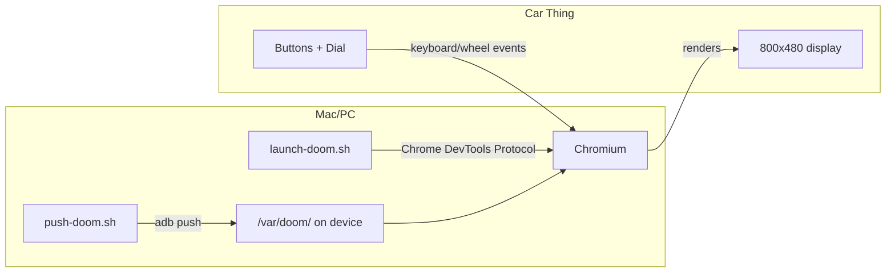
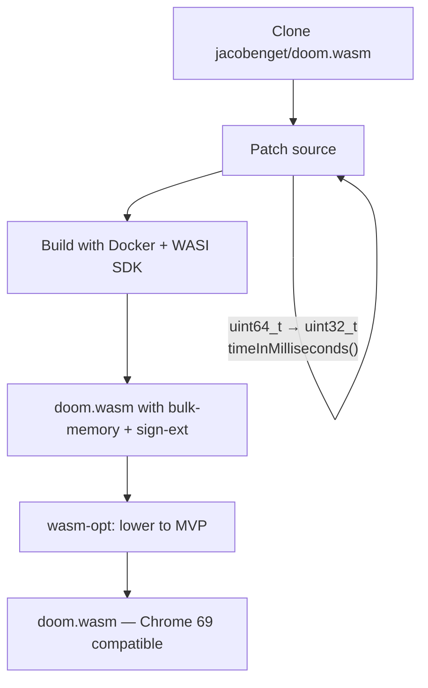
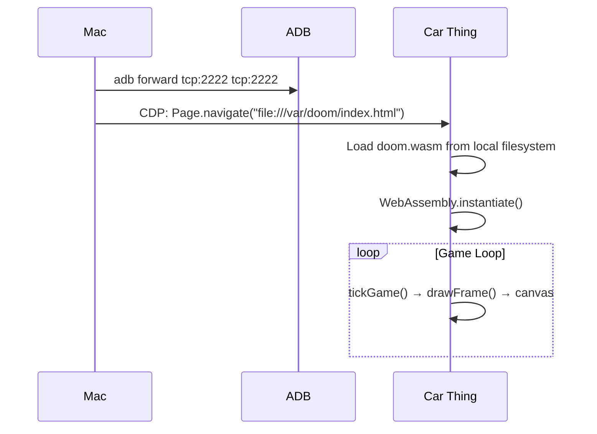

# Doom on Spotify Car Thing

Run the classic Doom (shareware) on a Spotify Car Thing using WebAssembly.


## How It Works

The Car Thing runs a Buildroot Linux with Chromium 69 (2018) in kiosk mode, managed by `supervisord`. We serve a WebAssembly Doom port to its browser.



## Quick Start

```bash
# 1. Push Doom to the device (one-time)
./push-doom.sh

# 2. Launch Doom (after each reboot/replug)
./launch-doom.sh
```

Requires: Python 3, `websockets` pip package, ADB (Android SDK platform-tools).

## Controls

```
┌─────────────────────────────────────────────┐
│  [1:Fwd] [2:Back] [3:StrafeL] [4:StrafeR]  │
│                                [5:Use/Open] │
│                                             │
│  ┌──────────────────────┐      ╭─────╮      │
│  │                      │      │Dial │      │
│  │     800×480 screen   │      │Turn │      │
│  │                      │      │L/R  │      │
│  └──────────────────────┘      ╰──┬──╯      │
│                              Push=Shoot     │
│  [Back: Doom Menu]              /Select     │
└─────────────────────────────────────────────┘
```

| Input | Event Code | Doom Action |
|---|---|---|
| Preset 1 | `Digit1` | Forward / Menu up |
| Preset 2 | `Digit2` | Backward / Menu down |
| Preset 3 | `Digit3` | Strafe left |
| Preset 4 | `Digit4` | Strafe right |
| 5th button | `KeyM` | Use / Open doors |
| Dial rotate | `WHEEL deltaX` | Turn left/right |
| Dial press | `Enter` | Shoot / Menu select |
| Back | `Escape` | Doom menu |

## Building doom.wasm

The Car Thing's Chrome 69 only supports WebAssembly MVP — no bulk-memory, no sign-ext, no BigInt. The stock [jacobenget/doom.wasm](https://github.com/jacobenget/doom.wasm) release uses these features, so we rebuild it.



### Steps

1. **Clone and patch**
   ```bash
   git clone https://github.com/jacobenget/doom.wasm.git build-doom
   cd build-doom
   ```

   Edit `src/doom_wasm.h` line 218:
   ```c
   // Change:
   IMPORT_MODULE("runtimeControl") uint64_t timeInMilliseconds();
   // To:
   IMPORT_MODULE("runtimeControl") uint32_t timeInMilliseconds();
   ```

   Edit `src/doom_wasm.c` line 175:
   ```c
   // Change:
   uint64_t DG_GetTicksMs() { return timeInMilliseconds(); }
   // To:
   uint64_t DG_GetTicksMs() { return (uint64_t)timeInMilliseconds(); }
   ```

2. **Build with Docker** (requires Docker Desktop)
   ```bash
   make all
   ```
   This produces `build/doom.wasm` with bulk-memory and sign-ext ops (WASI SDK libc requires them).

3. **Lower to WASM MVP** with [Binaryen](https://github.com/WebAssembly/binaryen)
   ```bash
   brew install binaryen  # if not installed

   # Two-step: lower post-MVP ops, then optimize
   wasm-opt build/doom.wasm \
     --enable-bulk-memory --enable-sign-ext \
     --llvm-memory-copy-fill-lowering \
     --signext-lowering \
     -o /tmp/doom-lowered.wasm \
     --no-validation

   wasm-opt /tmp/doom-lowered.wasm \
     -O2 \
     -o apps/doom/doom.wasm
   ```

The resulting `doom.wasm` (~4.3 MB) is fully self-contained — the shareware DOOM1.WAD is baked into the binary at compile time.

## Architecture

### Standalone (recommended)

Files are pushed to `/var/doom/` on the device (writable, survives reboots). `launch-doom.sh` uses ADB port forwarding + Chrome DevTools Protocol to navigate the existing Chromium instance.



### Python Server (development)

```bash
pip install -r server/requirements.txt
python -m server.main --app doom
```

FastAPI serves files over ADB reverse port forwarding. Useful for iterating on the web app without pushing files each time.

### DeskThing App

```bash
cd deskthing-doom
npm install
npx deskthing package
```

Produces `dist/deskthing-doom-v1.0.0.zip` — installable via DeskThing's app manager. Note: DeskThing's button/dial overlays conflict with Doom's input, so standalone mode is recommended for gameplay.

## Project Structure

```
├── apps/doom/              # Standalone Doom web app
│   ├── index.html          #   Page shell + canvas
│   ├── host.js             #   WASM host: imports, framebuffer, game loop
│   ├── input.js            #   Car Thing hardware → Doom key mapping
│   └── doom.wasm           #   Custom-built for Chrome 69
├── server/                 # Minimal Python server
│   ├── main.py             #   CLI entry point
│   ├── server.py           #   FastAPI HTTP + WebSocket
│   ├── adb_manager.py      #   ADB device management + CDP navigation
│   └── tests/              #   17 tests
├── deskthing-doom/         # DeskThing app package
│   ├── deskthing/          #   manifest.json
│   ├── server/             #   Server-side (minimal lifecycle hooks)
│   └── src/                #   Client-side (TypeScript Doom host + input)
├── push-doom.sh            # Push files to device
├── launch-doom.sh          # Navigate Car Thing to Doom
└── docs/                   # Design specs and implementation plans
```

## Technical Challenges

- **Chrome 69 WASM compatibility**: The Car Thing's browser is from 2018. Modern WASM features (bulk-memory, sign-ext, BigInt) don't work. We use Binaryen's lowering passes to polyfill them.
- **supervisord**: Chromium is managed by supervisord with `autorestart=true`. Killing it doesn't work — it respawns immediately. We use Chrome DevTools Protocol to navigate the existing instance instead.
- **Input mapping**: The Car Thing's rotary dial generates `wheel` events with `deltaX` (not `deltaY`). Buttons map to `Digit1-4`, `KeyM`, `Enter`, and `Escape`. We translate these to Doom key presses via the WASM module's `reportKeyDown`/`reportKeyUp` exports.
